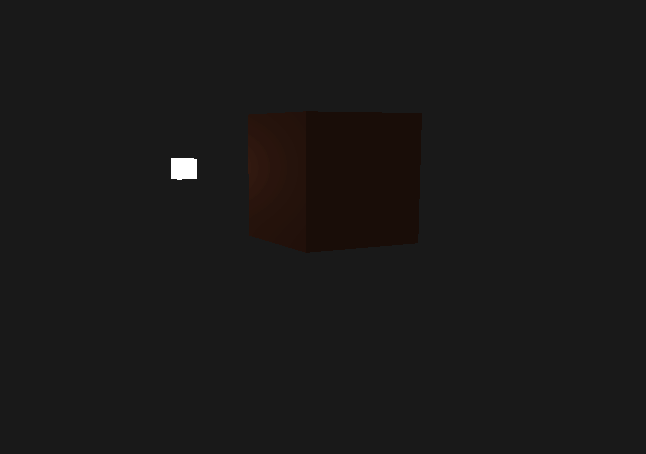

# OpenGL Basic Lighting

3D lighting scene using the Phong lighting model. 

Made for learning purposes based on the OpenGL tutorial from https://learnopengl.com/Lighting/Basic-Lighting created by Joey de Vries.

